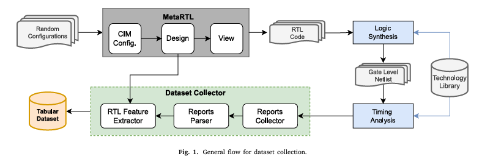

## 🗓️ Date: 2025-08-08

### ✅ Work Done
####  Exploring Introduction part

- Before that now [10.50am] i am just reading the intro part let's see what i get .
  
  ✍️ **My Thoughts:**  
>  IC design is a complex & itrative process , initially u read the spec , then design rtl , write constraint then map with *.lib then i get the gate level netlist , after finishing the synthesis we get the PDA value all those are done by the EDA tools, before fabrication the PPA value is validated .  Principally, designs must meet timing constraints and work at the desired clock frequency.
>  Classical methods estimating delay from a higher level of abstraction use **polynomial, macromodeling, and analytical** approaches.
> **They have several drawbacks:** they are slow, constrained by the type of components, computationally expensive, or give only a very rough estimation.
> here ml plays the role it having ability to predict with high accuracy.
> This paper proposes Neural Networks (NNs) for pin-to-pin component delay estimation of RTL components in Application-Specific IC designs.

###    General flow for dataset collection

-  In this paper, the training data are built using a model-driven HW generator framework.
-  ML models using one-hot encoded and embedding feature vectors are trained and fine-tuned. The trained models are used to get estimated pin-to-pin delay values. 
- They sequentially predict slew and delay values per component and then propagate the predicted slew along the delay path.
-  When training a model with a dataset of logic gates and multiplexers, a simple Multilayer Perceptron (MLP) using one-hot encoding achieves, on average, a coefficient of determination 𝑅2 of 87% w.r.t delay values from the EDA tool.
-   The MLP model using embedding feature vectors achieves an 𝑅2 score of 79%. Training with an enlarged dataset, the best results are obtained by the MLP architecture using an embedding input layer. This approach reaches, on average, an 𝑅2 of 77% and a Mean Squared Error (MSE) of
0.68%. Both models are around 8.4× faster than the EDA tools.
### ❗ Issues Faced
- Confused about how to extract SOG format
- Delay model accuracy low

### 📝 Learnings
- Importance of fanout and slew in delay prediction
- SOG better represents timing than AST

### 🔜 Next Steps
- Try different feature encodings (embedding vs one-hot)
- Compare MLP vs Random Forest

