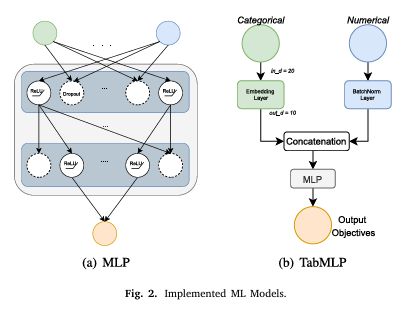

## 🗓️ Date: 2025-08-08

### ✅ Work Done
####  Exploring Introduction part

- Before that now [10.50am] i am just reading the intro part let's see what i get .
  
  ✍️ **My Thoughts:**  
>  IC design is a complex & itrative process , initially u read the spec , then design rtl , write constraint then map with *.lib then i get the gate level netlist , after finishing the synthesis we get the PDA value all those are done by the EDA tools, before fabrication the PPA value is validated .  Principally, designs must meet timing constraints and work at the desired clock frequency.
>  Classical methods estimating delay from a higher level of abstraction use **polynomial, macromodeling, and analytical** approaches.
> **They have several drawbacks:** they are slow, constrained by the type of components, computationally expensive, or give only a very rough estimation.
> here ml plays the role it having ability to predict with high accuracy.
> This paper proposes Neural Networks (NNs) for pin-to-pin component delay estimation of RTL components in Application-Specific IC designs.

###    General flow for dataset collection

-  In this paper, the training data are built using a model-driven HW generator framework.
-  ML models using one-hot encoded and embedding feature vectors are trained and fine-tuned. The trained models are used to get estimated pin-to-pin delay values. 
- They sequentially predict slew and delay values per component and then propagate the predicted slew along the delay path.
-  When training a model with a dataset of logic gates and multiplexers, a simple Multilayer Perceptron (MLP) using one-hot encoding achieves, on average, a coefficient of determination 𝑅2 of 87% w.r.t delay values from the EDA tool.
-   The MLP model using embedding feature vectors achieves an 𝑅2 score of 79%. Training with an enlarged dataset, the best results are obtained by the MLP architecture using an embedding input layer. This approach reaches, on average, an 𝑅2 of 77% and a Mean Squared Error (MSE) of
0.68%. Both models are around 8.4× faster than the EDA tools.

###  This paper is organized as follows:
- briefly reviews concepts related to Timing Analysis (TA) and to ML applied to regressio tasks. 
- provides an overview of the delay estimation state of the art
- describes our ML solution.
-  provides details of the benchmark circuits used to evaluate our trained models.

### 2.1.  Timing Analysis (TA)
- TA is an EDA tool to determine whether a design works properly at the required clock period.
-  TA can be dynamic or static.
-  The dynamic analysis simulates the complete circuit using input vectors and evaluating the outputs.
-  STA is a static approach, as it propagates the gate delays from primary inputs to outputs. The gate delay is the time needed for a signal to propagate through a gate, i.e., going from input to output port .
-  STA highly depends on the delay values used for each gate in the whole design. STA tools obtain the delay values using a Non-linear Delay Model (NLDM).
-  For a constant output load, an increase in the input slew will reduce the delay. For a constant input transition,the delay will increase when the fanout capacitance increases.
-  The slew is propagated along the circuit. The output slew of a cell is the input
 slew of the next connected cell in the timing path.
- Output slews are also defined via LUTs with input slew and fanout load as indexes.
- An NLDM stores delay and slew LUTs in a technology library as the Synopsis
 Liberty file [6]. STA tools can read those liberty files.
- **In this paper, an NLDM is employed for extracting ground truth
 labels for the delay and slew values. The prediction of these metrics
 is defined as a multi-objective regression problem that can be solved
 using ML.**

### 2.2. ML for regression tasks
- In this paper, a model is trained to solve a regression task. The building blocks required to solve such a task using ML are:**(a) MLP (b) TabMLP**
  ###  Implemented ML Models

####  2.2.1. Data collection
-  In a regression problem, the feature vectors 𝑣𝑖 per row 𝑖 are labeled with the 𝑛 target objectives 𝑦𝑛. The goal is to train a model that, given an unseen feature vector 𝑣, predicts the quantitative values 𝑦.
#### 2.2.2. Feature analysis
  -   2.2.2.1 Spearman’s Rank Correlation Coefficient (SRCC)
  -   2.2.2.2. Mutual Information
  -   2.2.2.3. F-Test
  -   2.2.2.4. Shapley values
###  2.2.3. Model selection
-  In this paper, an MLP [13] is used due to its simplicity and good performance in multi-objective tasks.
-  Fig. 2(a) sketches the main layers of an MLP: input, hidden,and output layer. The input layer is made of as many neurons as the number of input features. For all our models, the number of hidden layers, as well as the number of nodes for those, are hyperparameters.
###  2.2.4. Hyperparameter search
-Hyperparameters are model parameters that cannot be trained. Using optimal hyperparameters improves the model performance. Thus,hyperparameter search should be conducted. 

### ❗ Issues Faced
- Confused about how to extract SOG format
- Delay model accuracy low

### 📝 Learnings
- Importance of fanout and slew in delay prediction
- SOG better represents timing than AST

### 🔜 Next Steps
- Try different feature encodings (embedding vs one-hot)
- Compare MLP vs Random Forest

