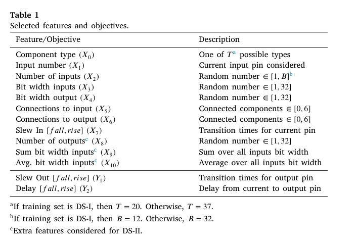
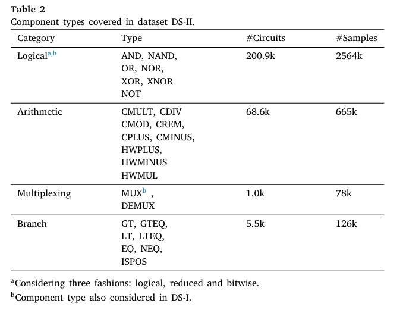
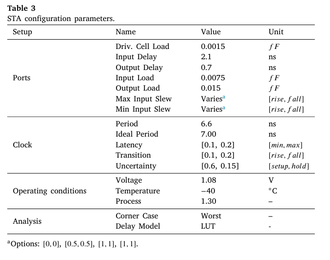

## 🗓️ Date: 2025-08-06

### ✅ Work Done
- **Details analysis os method used in this paper step by step ...**
-  Gate delay estimation is challenging due to the many dependencies: technology, operating conditions, cell types, outputs capacitance, and signal transition times. Therefore, we proposed a new approach to estimate cell delays using NNs. We define delay **pin-to-pin** estimation as a multi-objective regression problem. To get a more accurate delay estimation, the slew per gate is also predicted and propagated.
####  4.1. Data collection
- They use  a HW generator framework,which generate sour designs in a faster and automated way by using meta-modeling.The used HW generation famework is **MetaRTL**.
####  4.2. Feature selection
- **4.2.1. DS-I**
> In this dataset, twenty types of RTL components are used to build the training designs:multiplexers, inverters, and logicgates (AND,NAND,OR,NOR,XOR, andXNOR).The latter inabitwise, logical,and reduced fashion.  In DS-I, each design contains only theabove
mentionedRTL components,witha randomlygeneratednumber of inputs and bit widths.
-  **4.2.2. DS-II**
> DS-I is extended tocoverother component types such as demul tiplexing, arithmetic, and branch operators. This enlargeddataset is what they name DS-II.In total, our collected dataset DS-II
 consists of 3.4𝑀 samples
> For both datasets, the generated Verilog code is synthesized using Yosys,1[29]an open source tool that reads Verilog Hardware Description Language(HDL) file sand creates a gate-level netlist by mapping it to CMOS cells of the technology library.

> The synthesized netlists are the required input to the STA. In this work,OpenSTA2 [30] isused, an open-source version of the commercial Parallaxtimer tool.A technology library configuration
 is chosen,and the tool is setup with parameters exemplarily shown in Table3.
>Table2 shows the number of samples per component category.The columns of the dataset
 contain the RTL features as well as ground truth labels.
 #### 4.3. Feature analysis
 - 4.3.1. SRCC:
 - 4.3.2. MI and F-test:
 - 4.3.3. Shapley values:
#### 4.4. Neural networks
- 4.4.1. Pre-processing
- 4.4.2. Architectures
- 4.4.3. Training, validating and testing
### ❗ Issues Faced
- Confused about how to extract SOG format
- Delay model accuracy low

### 📝 Learnings
- Importance of fanout and slew in delay prediction
- SOG better represents timing than AST

### 🔜 Next Steps
- Try different feature encodings (embedding vs one-hot)
- Compare MLP vs Random Forest

